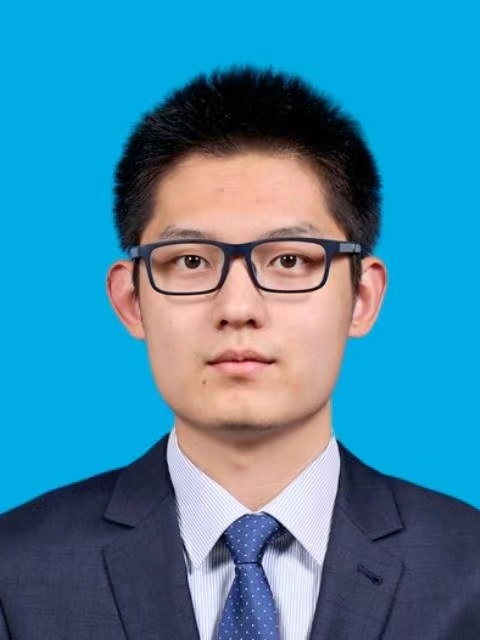
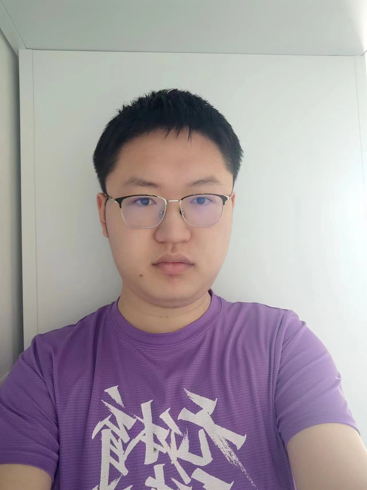
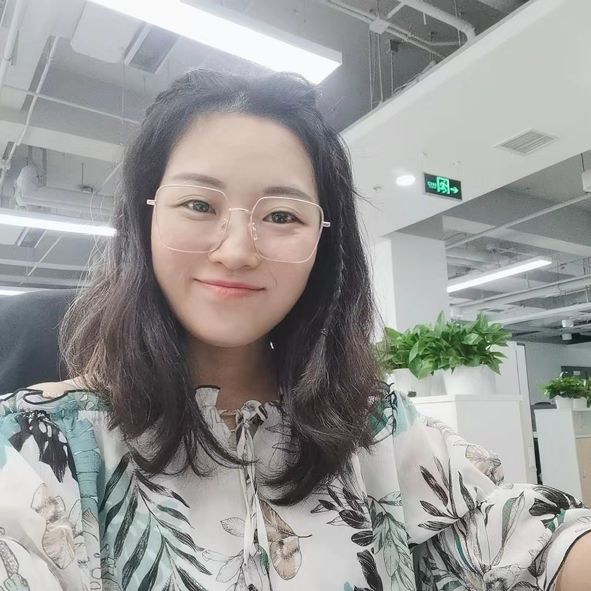

# 参赛手册

## 比赛内容
当前基于扩散模型（Diffusion model）的文到图生成已经取得了显著进展，只需要通过简单的自然语言的描述即可生成高质量图像，这种技术在电子商务、虚拟现实、娱乐等领域有着广泛应用，显著提高了图像生成的效率和质量，也为用户带来了更加方便和丰富的图像体验。

在大模型的广泛应用中，个性化对于许多应用领域来说非常重要，因为不同的用户或任务需要不同的模型行为或输出。个性化可以使模型更好地适应特定用户或任务的需求，并提高模型的预测或生成效果。此外，大模型的可控生成的能力也是影响大模型应用到精细的下游领域的重要因素。

为了推动扩散模型在模型个性化和可控生成技术的发展，本赛题提供了基座扩散模型UniDiffuser，参赛选手基于此模型，进行人脸的个性化生成和精细的生成控制。比赛旨在寻找高效、准确、创意的个性化和可控生成方案，从而提升人工智能内容生成领域的研究水平。

## 比赛任务
初赛任务的总体目标是能够根据提供的数据集，很好的生成复现原人物的特征，同时保证尽可能好的可编辑性。比赛的pipeline中不能有人的介入（不能通过人的判断来给模型提供技术路线或者编辑引导的介入）。
初赛需要实现的功能：
- 复现: 生成的图片和训练图片的相似度
- 编辑: 在给定编辑指令的情况下能够同时做到人物的复现和给定指令的遵循

**模型:**
比赛使用Unidiffuer作为基座模型，注意：为了比赛公平性，选手均需基于Unidiffuer进行二次开发，不得使用其他预训练的文到图生成模型。在图像预处理和后处理等阶段可以使用其他的人工智能模型。

**数据:**
由赛方提供的个人物图片集(两男两女，共4个数据集)。同时比赛还会提供测试的编辑指令用于进阶功能的本地测试。正式比赛时赛方会提供与本地编辑指令相似的隐藏测例进行测评。

| 数据集名称 | 数据集内容 | 数据集大小| 数据样例 |
| --- | --- | --- | ---- |
| boy1 | 男性照片| 3张| |
| boy2 | 男性照片| 10张|  |
| girl1 | 女性照片| 3张| |
| gril2 | 女性照片| 10张| |


## 开始比赛


### 环境搭建&比赛资源获取
比赛使用python为主要的编程语言, pytorch为主要的深度学习库。
我们提供了一个开发过程中所使用的环境列表:
```
pip install -r requirements.txt -i https://pypi.tuna.tsinghua.edu.cn/simple
```

同时我们也提供**Docker 环境:**

将下载的代码文件解压, 随后挂载到docker镜像即可。
```shell
docker pull xiangxiaoyu/unidiffuser:v1.0
docker run -it --rm --gpus all  \
-v ./<解压后的路径>:/workspace \
xiangxiaoyu/unidiffuser:v1.0 /bin/bash
```


从[云盘](https://cloud.tsinghua.edu.cn/d/1f0f8b1ada0e46a68542/)下载需要使用的模型，并放置于`models`文件夹:
```
├── autoencoder_kl.pth
├── caption_decoder.pth
├── gpt2
│   ├── config.json
│   ├── generation_config.json
│   ├── merges.txt
│   ├── pytorch_model.bin
│   ├── tokenizer.json
│   └── vocab.json
└── uvit_v1.pth
```


### 文件介绍
此仓库的文件树如下, 每个重要文件的开头都有对文件作用和允许修改的文件范围进行说明,建议赛手在比赛过程中首先阅读这些内容。

``` shell
├── bench_samples_standard # sample_bench在无优化情况下生成的标准图片
│   ├── an elephant under the sea-000.jpg
│   ├── ....
├── configs # 模型的配置文件
│   ├── sample_config.py
│   └── unidiffuserv1.py
├── libs  # 训练和生成代码所用到的依赖文件
│   ├── autoencoder.py
│   ├── ....
├── model_output # 用于存放训练产生的模型
│   ├── boy1
│   ├── boy2
│   ├── girl1
│   └── girl2
├── models # 用于存放需要使用的初始模型(从云盘下载后放置于此, 请保持文件结构一致)
├── README.md # 本文件
├── sample_bench.py # 用于测试内存使用和推理速度的文件
├── sample.py # 基于prompt模型生成图片的文件
├── sample.sh # 基于所有数据集进行生成
├── score_utils # 用于计算分数的文件
├── score.py # 计算得分的文件
├── train_data # 训练数据
│   ├── boy1
│   ├── boy2
│   ├── girl1
│   └── girl2
├── train.py # 训练代码
├── train.sh # 批量训练代码
└── utils.py # 通用函数
```

训练代码说明:

基于单个数据集进行训练:
```shell
accelerate launch --mixed_precision fp16 --num_processes 1 train.py -d '<训练文件所在位置>' -o '<模型输出>'
```

训练所有数据集:
```shell
./train.sh
```
训练过程中的数据预处理, 模型架构, 加载方式等等均可进行修改, 只需要满足命令行接口即可, 并且模型输出位置的输出形式能够被`sample.py`文件正确解析即可。


生成代码说明:

基于prompt文件生成图片:
```shell
python sample.py --restore_path '<模型输出>' --prompt_path '<prompt文件路径>' --output_path '<输出路径>'
```
基于所有的prompt文件进行生成:
```
./sample.sh
```
文件中sample的方式, prompt均可以更改, 但是测评时只会根据文件中的prompt进行测评。每个prompt要求输出三张图片, 并存放于目标路径。模型输出路径只需要能够正确解析训练产生的文件夹即可(若使用高效参数微调方法, 只需要将额外参数保存到输出路径并在sample.py中加载即可, 无需保存整个模型, 原模型可以从`models/uvit_v1.pth`中加载)。`sample.py`除了会生成图片, 还会检查用于生成的模型和原模型的参数差异大小, 用于衡量微淘的参数量, 具体的计算方式见代码。


### 客观指标打分(部分)
```shell
python score.py

# 默认路径为
    # --dataset: './train_data/'
    # --prompts: './eval_prompts/'
    # --outputs: './outputs/'

# 可自行提供路径
python score.py --dataset '<数据路径>' --prompts '<prompt路径>' --outputs '<提交路径>'
```


## 其他注意事项
- 数据安全问题: 本次比赛提供的数据仅限比赛使用。赛手出现违规使用比赛数据, 或者广泛传播比赛数据以及生成的图片的, 赛方可以取消比赛选手的参赛资格。


## 可参考的资料

- [Textural inversion](https://arxiv.org/abs/2208.01618)
- [DreamBooth](https://arxiv.org/abs/2208.12242)
- [Custom Diffusion](https://www.cs.cmu.edu/~custom-diffusion/)
- [A Closer Look at Parameter-Efficient Tuning in Diffusion Models](https://arxiv.org/abs/2303.18181)
- [unidiffuser](https://github.com/thu-ml/unidiffuser)
- [LoRA](https://github.com/microsoft/LoRA)


